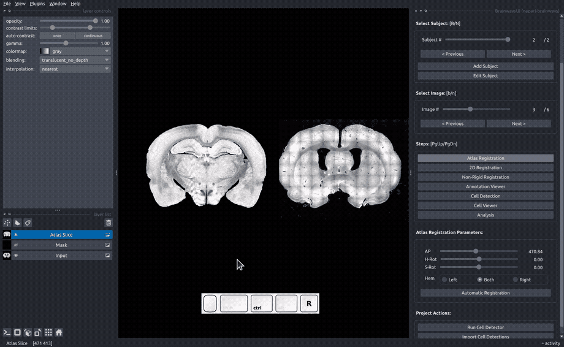

# Brainways

[](https://doi.org/10.1101/2023.05.25.542252)
[](https://github.com/bkntr/brainways/raw/main/LICENSE)
[](https://pypi.org/project/brainways)
[](https://python.org)
[](https://github.com/bkntr/brainways/actions)
[](https://codecov.io/gh/bkntr/brainways)
[](https://napari-brainways.readthedocs.io/en/latest/?badge=latest)
[](https://napari-hub.org/plugins/napari-brainways)

<!-- markdownlint-disable MD026 -->
## What Is Brainways?
<!-- markdownlint-enable MD026 -->

Brainways is an AI-based tool for automated registration, quantification and generation of brain-wide activity networks based on fluorescence in coronal slices.



<!-- markdownlint-disable MD026 -->
## Why Brainways?
<!-- markdownlint-enable MD026 -->

Coronal slice registration, cell quantification and whole-brain contrast analysis between experimental conditions should be made easily accessible from a single software, without requiring programming experience.
Customization should be made easy by having a highly flexible pythonic backend.

## Getting Started

To install and run brainways, run the following in your python environment:

```bash
pip install napari-brainways
napari -w napari-brainways
```

Follow our [getting started guide](https://napari-brainways.readthedocs.io/en/latest/getting_started/) for more details.

## How it works

Brainways allows users to register, quantify and provide statistical contrast analysis by following several simple steps:

1. Rigid registration of coronal slices to a 3D atlas.
1. Non-rigid registration of coronal slices to a 3D atlas, to account for individual difference and imperfections in acquisition procedure.
1. Cell detection (using [StarDist](https://github.com/stardist/stardist)).
1. Quantification of cell counts per brain region.
1. Statistical analysis:
    * ANOVA contrast analysis.
    * PLS (Partial Least Square) analysis.
    * Network graph creation.

<!-- For a quick 10 minute overview of brainways, check out the demo presented to The Social Club community
meeting:

[](https://youtu.be/aWDIQMbp1cc?t=1m4s) -->

## Architecture

Brainways is implemented as three python packages. [*napari-brainways*](https://github.com/bkntr/napari-brainways) contains the GUI implementation as a [napari](https://napari.org/stable/) plugin. napari-brainways is using [*brainways*](https://github.com/bkntr/brainways) as its backend. All of the functionality is implemented in the brainways package. This separation was done to guarantee that brainways is a GUI-agnostic software, and can be fully accessed and manipulated through python code to allow custom complex usage scenarios. The code that was used to train, evaluate and run the automatic registration model resides in [*brainways-reg-model*](https://github.com/bkntr/brainways-reg-model).

## Development Status

Brainways is being actively developed by Ben Kantor of Bartal lab, Tel Aviv University, Israel. Our releases can be found [here](https://github.com/bkntr/napari-brainways/releases).

## Citation

If you use brainways, please cite [Kantor and Bartal (2023)](https://doi.org/10.1101/2023.05.25.542252):

    @article{kantor2023brainways,
      title={Brainways: An Open-Source AI-based Software For Registration and Analysis of Fluorescent   Markers on Coronal Brain Slices},
      author={Kantor, Ben and Ben-Ami Bartal, Inbal},
      journal={bioRxiv},
      pages={2023--05},
      year={2023},
      publisher={Cold Spring Harbor Laboratory}
    }

## License

Distributed under the terms of the [GNU GPL v3.0] license,
"napari-brainways" is free and open source software

## Issues

If you encounter any problems, please [file an issue] along with a detailed description.

[napari]: https://github.com/napari/napari
[Cookiecutter]: https://github.com/audreyr/cookiecutter
[@napari]: https://github.com/napari
[MIT]: http://opensource.org/licenses/MIT
[BSD-3]: http://opensource.org/licenses/BSD-3-Clause
[GNU GPL v3.0]: http://www.gnu.org/licenses/gpl-3.0.txt
[GNU LGPL v3.0]: http://www.gnu.org/licenses/lgpl-3.0.txt
[Apache Software License 2.0]: http://www.apache.org/licenses/LICENSE-2.0
[Mozilla Public License 2.0]: https://www.mozilla.org/media/MPL/2.0/index.txt
[cookiecutter-napari-plugin]: https://github.com/napari/cookiecutter-napari-plugin

[file an issue]: https://github.com/bkntr/napari-brainways/issues

[napari]: https://github.com/napari/napari
[tox]: https://tox.readthedocs.io/en/latest/
[pip]: https://pypi.org/project/pip/
[PyPI]: https://pypi.org/
