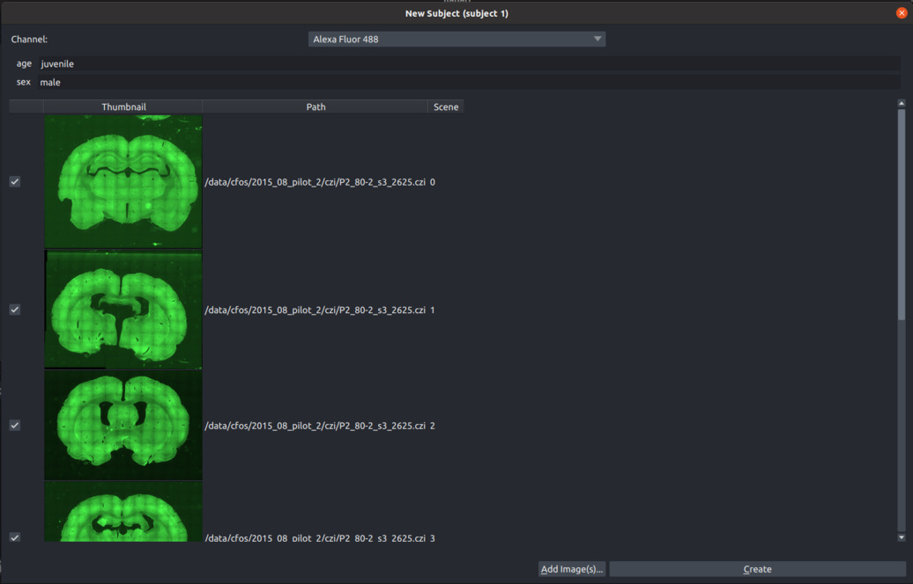

# Getting Started

This guide will walk you through installing Brainways and starting your first project.

## Prerequisites

*   **Python:** You need Python version 3.9, 3.10, 3.11, or 3.12 installed. You can download it from [python.org](https://www.python.org/downloads/).

!!! tip "Use a Virtual Environment"
    We strongly recommend installing Brainways in a dedicated virtual environment (e.g., using `venv` or `conda`) to avoid conflicts with other Python packages.

        # Example using venv
        python -m venv brainways-env
        source brainways-env/bin/activate  # On Windows use `brainways-env\Scripts\activate`

!!! warning "GPU Support for Cell Detection (Optional but Recommended)"
    If you plan to use the Cell Detection features, installing TensorFlow with GPU support *before* installing Brainways is highly recommended for performance. Brainways installs StarDist (which uses TensorFlow) as a dependency. Follow the official [TensorFlow GPU installation guide](https://www.tensorflow.org/install/pip) first, then proceed with the Brainways installation below (there seems to be an issue in some environments with TensorFlow 2.20. If you encounter issues, try to install TensorFlow 2.19).

## 1. Install Brainways

Once your environment is set up (and TensorFlow with GPU support is installed, if desired), install Brainways using pip:

```bash
pip install brainways
```
This command installs the Brainways GUI and all necessary dependencies.

## 2. Launch Brainways

To start the Brainways application, run the following command in your terminal (ensure your virtual environment is activated if you used one):

```bash
brainways ui
```

**First Launch:** The first time you run Brainways, it will automatically download additional components:
*   [QuPath](https://qupath.github.io/): Used for robust image reading.
*   3D Rat/Mice Atlases: Downloaded via [bg-atlasapi](https://github.com/brainglobe/bg-atlasapi).
*   Brainways Registration Model Weights: For automatic atlas alignment.

## 3. Your First Brainways Project

You have two options to get started: load a sample project or create your own.

### Option A: Loading a Sample Project (Recommended for Beginners)

Brainways includes sample projects to help you explore its features quickly:

1.  **Sample Project:** Contains unregistered sample images.
2.  **Annotated Sample Project:** Contains fully processed images, showcasing registration, cell detection, and analysis results.

To load one, go to the menu: `File -> Open Sample -> Brainways -> Sample project` (or `Annotated sample project`).

{: width='70%' }

### Option B: Creating a New Brainways Project

If you have your own image data, follow these steps:

1.  Click the `Project -> New` button in the right-hand panel.
2.  In the file dialog, **select or create a new, empty directory** for your project. Brainways will store all project data here.
3.  The "New Brainways Project" dialog appears. Configure the following:
    *   **Atlas:** Select the reference atlas. The *whs_sd_rat_39um* atlas includes an automatic registration model. Other atlases require manual registration.
    *   **Condition types (Optional):** Define experimental variables (e.g., `treatment`, `genotype`). Separate multiple types with semicolons (e.g., `treatment;genotype`). These allow grouping subjects for analysis.

#### Adding Subjects



Add each experimental subject (e.g., individual animal) to your project:

1.  Click the `Add Subject` button.
2.  Enter a unique **Subject ID**.
3.  If you defined condition types, assign values for this subject (e.g., `treatment=control`, `genotype=WT`).
4.  Click `Add Image(s)` and select **all the 2D slice images** belonging to this subject (this single brain).
    *   *Important:* Do not mix images from different brains within one subject.
5.  If using multi-channel images, select the channel containing the signal you want to quantify (e.g., the fluorescent marker).
6.  Click `Create` to add the subject and their images to the project.
7.  Repeat steps 1-6 for all subjects in your experiment.

## 4. Working with Brainways: Registration

After creating a project, the primary task is registering each slice image to the 3D atlas. This involves several steps for each slice.

!!! tip "Best Practices"
    Before proceeding, review the [Best Practices Guide](04_best_practices.md) for tips on achieving accurate results.

!!! tip "Keyboard Shortcuts"
    Most sliders and controls can be adjusted using keyboard shortcuts. Press `?` within any registration panel to see the available shortcuts for that step.

The registration process typically involves these stages:

#### Atlas Registration

*   **Goal:** Align the slice image (right panel) with the corresponding atlas slice (left panel).
*   **How:** Adjust the sliders in the right panel. If only one hemisphere is present, select it using the "Hem" dropdown.
*   **Automatic:** If an automatic registration model is available for the selected atlas (like *whs_sd_rat_39um*), it will run automatically when you open an image. You can then refine the result manually if needed.


#### Rigid Registration (Affine)

*   **Goal:** Fine-tune the alignment using rotation, scaling, and translation so the slice roughly matches the atlas overlay.
*   **How:** Adjust the sliders in the "Rigid registration" panel.


#### Non-rigid Registration (Elastic)

*   **Goal:** Deform the slice image elastically to precisely match the atlas contours, accounting for small anatomical variations.
*   **How:**
    *   **Manual:** Drag the blue control points until the underlying image structures align with the atlas overlay.
    *   **Automatic:** Click the `Elastix` button to use the Elastix algorithm for automatic elastic registration (this can take some time).


## 5. Cell Detection (Optional)

Brainways uses the [StarDist](https://github.com/stardist/stardist) algorithm to detect cells (e.g., labeled neurons) in your images.

!!! tip "Train a Custom Model for Best Results"
    The default StarDist models may not perform well on all datasets. For optimal accuracy, **training a custom StarDist model** on your specific experimental data is highly recommended. See the [Cell Detection Guide](03_cell_detection.md) for instructions.

!!! warning "GPU Recommended"
    As mentioned in the prerequisites, using a GPU significantly speeds up cell detection. Ensure TensorFlow with GPU support is installed if you need faster processing.

**Steps:**

1.  **Preview (Recommended):** Cell detection on full-resolution images can be slow. To test parameters quickly:
    *   Double-click on a small, representative area in your image to define a preview region.
    *   Adjust normalization parameters (`Percentile low`, `Percentile high`) in the "Cell detection" panel.
    *   Click `Run on preview`. Check the results in the preview area.
2.  **Adjust Parameters:**
    *   Fine-tune normalization parameters based on the preview.
    *   **Unique Settings:**
        *   Check the `unique` box: The current parameters apply *only* to this specific image.
        *   Uncheck the `unique` box: The current parameters become the default for *all* images in the project (unless overridden by a unique setting).
3.  **Run on Full Project:** Once satisfied with the parameters (ideally after testing on previews from several images/subjects):
    *   Click the `Run Cell Detector` button. This processes all images in the project, which can take considerable time (potentially hours for large projects).


## 6. Outputs and Analysis

Once registration is complete (and optionally, cell detection has been run), you can export data and perform analyses.

### Exporting Data

#### Export Excel with Cell Density per Region

Generate a spreadsheet summarizing cell counts and densities for each annotated brain region.

1.  Go to the `Analysis` section and click `Calculate results`.
2.  Configure the options:
    *   **Min Structure Square Area (μm²):** Exclude small regions below this area threshold.
    *   **Cells Per Square Area (μm²):** Define the unit area for density calculation (e.g., 10000 for cells/mm²). Raw counts are always included.
    *   **Min/Max Cell Area (μm²):** Filter detected cells based on their size (useful for removing noise or artifacts).
    *   **Excel Mode:**
        *   `Row per Subject`: Aggregates data across all slices for each subject.
        *   `Row per Slice`: Provides data for each individual slice.
3.  Click `OK`. The calculation may take some time.
4.  The Excel file will be saved in your project directory.

#### Export Registered Annotation Masks

Export the atlas regions mapped onto your slice coordinates. This is useful for analysis in other software.

1.  Go to the `Analysis` section and click `Export Registered Annotation Masks`.
2.  Configure the options:
    *   **Output Directory:** Choose where to save the mask files.
    *   **Slice Selection:** Export masks for the `Current Slice`, `Current Subject`, or `All Subjects`.
    *   **File Format:** Choose `CSV`, `NPZ` (NumPy), or `MAT` (MATLAB).
3.  Click `OK`.
4.  Files (named after the original images) will be saved in the specified directory.

### Performing Analysis

Brainways offers built-in statistical tools to analyze cell distribution patterns across experimental conditions. Access these via the `Analysis` panel.

!!! note
    Analysis requires cell detection data. Ensure you have run the cell detector on your project first.

#### ANOVA Contrast Analysis

*   **Purpose:** Identify brain regions showing statistically significant differences in cell counts/density between experimental groups defined by your conditions.
*   **Method:** Performs ANOVA on each region, with corrections for multiple comparisons (FDR by default, others available). Post-hoc tests identify specific group differences.
*   **Output:** Results are displayed visually on the atlas and saved to an Excel file: `<PROJECT_DIR>/contrast-<CONDITION>-cells.xlsx`. Click `Show Posthoc` to view pairwise comparisons.


#### PLS (Partial Least Squares) Contrast Analysis

*   **Purpose:** A multivariate technique to find patterns of brain region activity that best differentiate experimental conditions.
*   **Method:** Uses the [pyls](https://github.com/rmarkello/pyls) package. Identifies latent variables (LVs) representing condition contrasts and calculates 'saliences' indicating each region's contribution. Significance is assessed via permutation testing and bootstrapping.
*   **Output:** Results (salience plots, LV significance) are saved as PNG and Excel files in `<PROJECT_DIR>/__outputs__/PLS/`.

#### Network Graph Analysis

*   **Purpose:** Explore functional connectivity by calculating correlations in cell counts between brain regions.
*   **Method:** Creates a graph where nodes are brain regions and edges represent significant Pearson correlations (threshold adjustable, FDR corrected).
*   **Output:** The network graph is exported as a GraphML file (compatible with graph analysis software like Gephi or NetworkX) to `<PROJECT_DIR>/__outputs__/network_graph/`.
