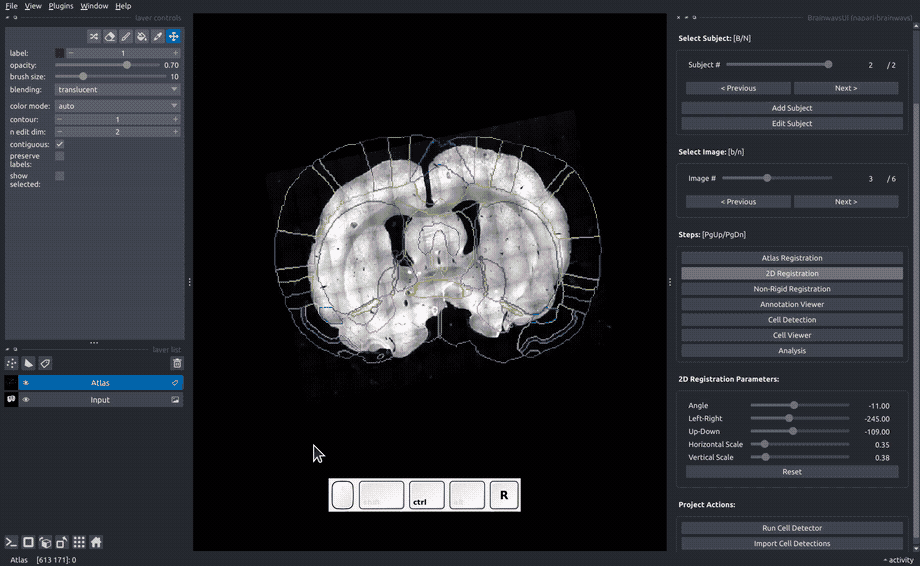

# Getting Started

## Requirements

* Installed [python](https://www.python.org/downloads/) 3.9.

!!! tip
    We recommend installing brainways in a separated virtual environment, for example using [anaconda](https://docs.anaconda.com/free/anaconda/install/).

## 1. Install Brainways

Run the following command (if you created a virtual environment, run this command inside the virtual environment):

```bash
pip install napari-brainways
```

This will install the brainways GUI along with all of its dependencies. After this command successfully finished, you are ready to use brainways.

## 2. Launch Brainways

Launch brainways using the following command (if you installed brainways in a virtual environment, execute this command inside the virtual environment):

```bash
brainways ui
```

The first time Brainways is launched, it will automatically download the following dependencies:

* [QuPath](https://qupath.github.io/), used in Brainways for its amazing image reading capabilities.
* Rat/mice 3d atlases (via [bg-atlasapi](https://github.com/brainglobe/bg-atlasapi)).
* Brainways automatic registration model weights.

## 3. Your First Brainways Project

If you have images waiting to be registered, you can create a [new brainways project](#creating-a-new-brainways-project). If you don't have your own images, or just want to jump right in, brainways comes with two [sample projects](#loading-a-sample-project).

### Loading a Sample Project

Brainways comes with two sample projects:

1. Sample project: contains sample images.
1. Annotated sample projects: contains fully-annotated and quantified sample images to quickly showcase all of the features that are enabled after fully annotating a project.

The sample projects can be loaded by using the following menu items: `File -> Open Sample -> Brainways -> Sample project / Annotated sample project`

{: width='70%' }

### Creating a New Brainways Project

1. In the right hand panel, click the `Project -> New` button.
1. In the file menu dialog, create your project in a **new empty directory**.
1. The "New Brainways Project" dialog will open with the following options:
    * **Atlas:** Choose the atlas you'd like to register to (*whs_sd_rat_39um* comes with an automatic registration model, but other atlases can be used for manual registration).
    * **Condition types:** the condition types in your experiment. Each subject can be assigned a condition for each of the given condition types, for example "age" and "sex". If you have more than one condition type, they should be separated by a comma, for example: `age;sex`

#### Adding Subjects


1. Click the `Add Subject` button and insert a Subject ID.
1. If condition types were given, fill in the experimental conditions (for example `age=juvenile`, `sex=male`).
1. Click the "Add Image(s)" button and choose one or more slice image files to add to the current subject (add all slice images that belong to a single brain. We do not recommend mixing different brains in a single subject).
1. For multi-channel images, choose the channel with the fluorescent marker to be quantified.
1. To finish creating a subject, click the "Create" button.
1. Follow the previous steps again to add all subjects in your experiment.

## 4. Working with Brainways

### Slice registration to the 3D atlas

Once a new project is created, register all the slices to the 3D atlas by following the registration steps for each slice image.

!!! tip
    All registration sliders can be quickly adjusted using keyboard shortcuts. To see a full list of the keyboard shortcuts for each step, click "?" on your keyboard.

#### Atlas registration

In the "Atlas registration" panel, you will see the slice image on the right and an atlas slice image on the left. Adjust the sliders on the right panel until your slice matches the atlas slice. If only one of the hemispheres is visible, choose the visible hemisphere in the "Hem" box.

If an auomatic registration algorithm is available for the current atlas, it will be automatically run on every image upon image opening.


#### Rigid registration

In the "Rigid registration" panel, adjust the sliders until the slice image roughly matches the atlas annotated that is overlayed on the image.



#### Non-rigid registration

To accomodate subtle differences between different brains, the images can be elastically deformed to perfectly match the atlas slice. To do that, move the blue dots until the underlying structures matches the atlas annotation overlay. The "Elastix" button can be used to perform automatic elastic registration using the Elastix algorithm.


### Cell detection

Active cells can be detected for each image using the [StarDist](https://github.com/stardist/stardist) cell detection algorithm. Because cell detection is performed on the full resolution images and can take a significant amount of time, detections can be run on a small preview crop to make sure that it works properly. To run cell detection on a preview crop, double-click on the relevant area in your image, and then click on the "Run on preview" button. If the detections are not satisfactory, the image normalization parameters can be adjusted to achieve better results.

The "unique" check box can be used to determine whether the adjusted normalization parameters will be used only for this image or for the whole project:
* If the "unique" checkbox is ticked, the parameters will only be used for this image.
* If the "unique" checkbox is not ticked, the parameters will be used for the whole project.


### Analysis

Once all images are annotated and cell detection is run on all images, statistical analysis can be performed to find neural patterns which differentiate between experimental conditions.

Several kinds of analyses are supported:

1. ANOVA contrast analysis
1. PLS (Partial Least Squares) contrast analysis
1. Network graph analysis

#### ANOVA contrast analysis

ANOVA contrast analysis can be performed through Brainways to identify and visualize the brain regions that contributed to the contrast between different experimental conditions. ANOVA is performed on each brain region separately, followed by FDR correction for multiple comparisons. Other multiple comparison methods can be used (see full list of multiple comparison methods [here](https://www.statsmodels.org/dev/generated/statsmodels.stats.multitest.multipletests.html)). Regions that significantly contributed to the contrast are subjected to post hoc analysis to identify the particular differences between condition pairs. To display a posthoc statistical analysis between two conditions, click the "Show Posthoc" button. All ANOVA and posthoc values are saved to an excel file in the project directory under:

```
<PROJECT_DIR>/contrast-<CONDITION>-cells.xlsx
```


#### PLS (Partial Least Squares) contrast analysis

Task PLS is a multivariate statistical technique that is used to identify optimal neural activity patterns that differentiate between experimental conditions. PLS produces a set of mutually orthogonal pairs of latent variables (LV). One element of the LV depicts the contrast, which reflects a commonality or difference between conditions. The other element of the LV, the relative contribution of each brain region (termed here ‘salience’), identifies brain regions that show the activation profile across tasks, indicating which brain areas are maximally expressed in a particular LV. Statistical assessment of PLS is performed using permutation testing for LVs and bootstrap estimation of standard error for the brain region saliences. The significance of latent variables is assessed by permutation testing. The reliability of the salience of the brain region is assessed using bootstrap estimation of standard error. Brain regions with a bootstrap ratio >2.57 (roughly corresponding to a confidence interval of 99%) are considered to be reliably contributing to the pattern. Missing values are interpolated by the average for the test condition. Brainways uses the [pyls](https://github.com/rmarkello/pyls) Python package to perform the PLS analysis.

The results of the analysis are exported to an Excel file and to PNG files containing the salience plot, the LV p values and the LV contrast direction. The files can be found in the project directory under:

```
<PROJECT_DIR>/__outputs__/PLS/
```

#### Network graph analysis

To examine the functional connectivity between the different brain regions, Brainways can be used to create a network graph based on inter-region positive cell count correlation matrices. Network nodes consist of the different brain regions as defined in the atlas, and the edges of the network consist of significant correlations between the regions (the significance threshold can be adjusted by the user, by default p<0.05), based on Pearson’s pairwise correlation. The values are FDR corrected for multiple comparisons. The network graph is exported to a graphml file, and can be used with any graph analysis tools and algorithms for further analysis. The file can be found in the project directory under:

```
<PROJECT_DIR>/__outputs__/network_graph/
```
